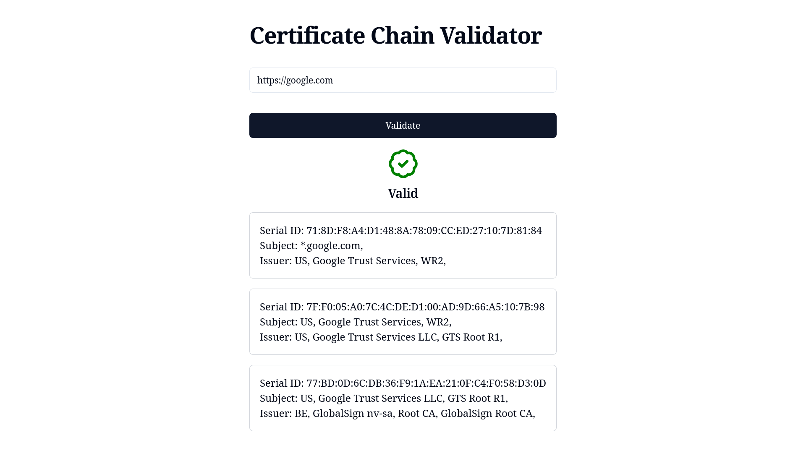

# Certificate Chain Validator

A Next.js application which validates the certificate chain for a user entered domain, the application utilizes openssl, pkijs, and CRL and OSCP to validate the certificates.

# Screenshot

# Libraries Used

- pkijs
